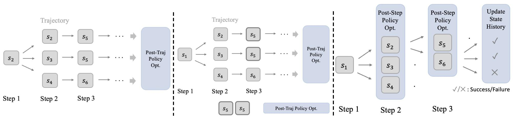
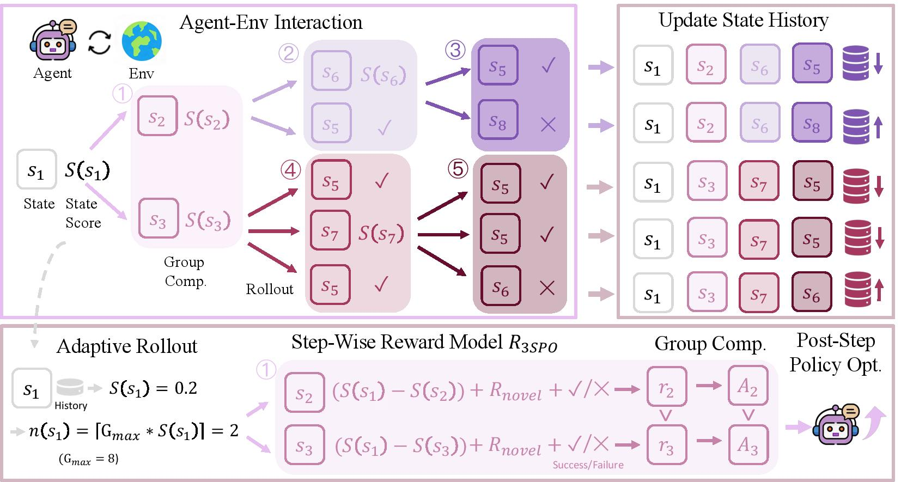
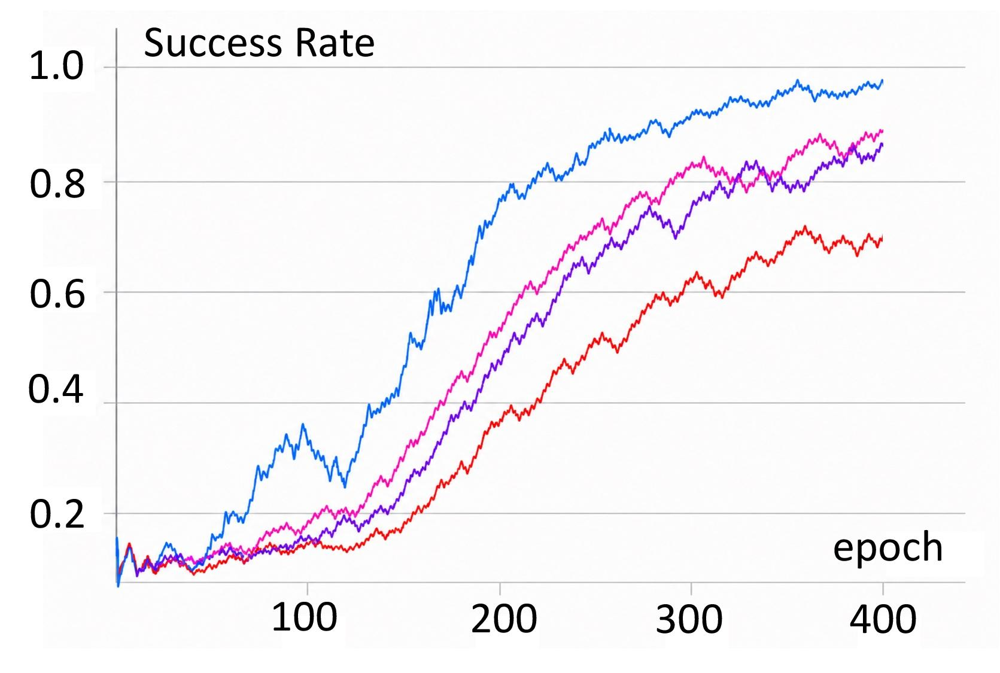
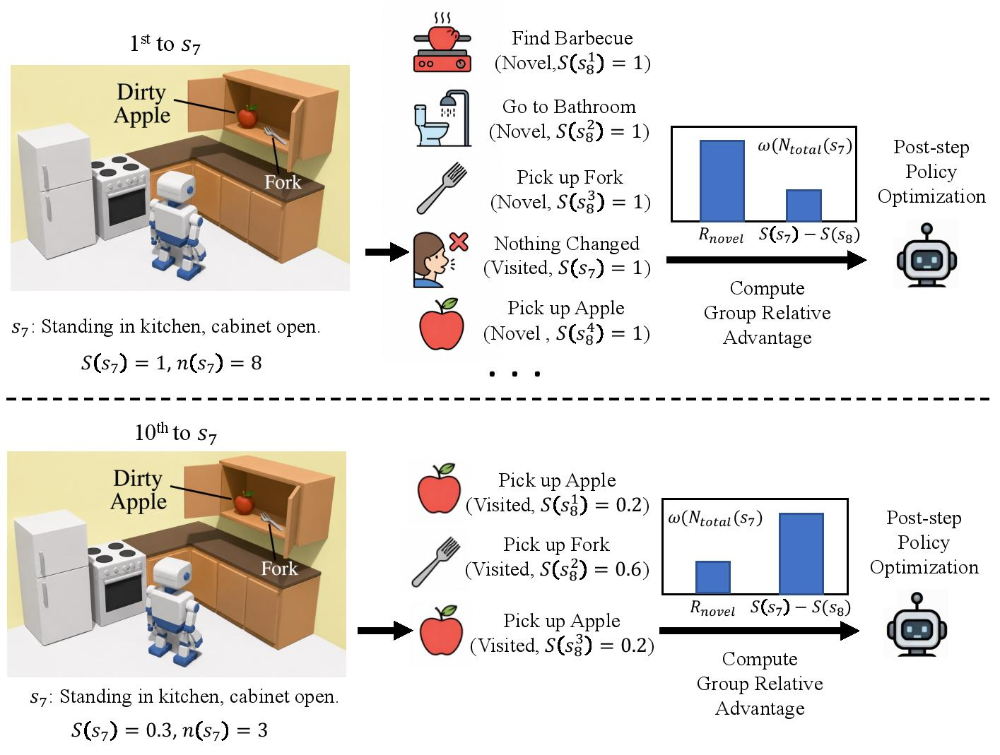

# 3SPO: State-Score-Supervised Policy Optimization

[](https://arxiv.org/abs/2606.09961)

## Motivation: From Post-Trajectory to Post-Step Optimization

Most trajectory-level RLHF methods (GRPO / PPO / DPO) apply policy optimization only after a full trajectory completes — treating all intermediate states equally. 3SPO shifts to **post-step policy optimization**, assigning credit at every state transition and allocating more rollouts to harder states. The figure below illustrates the paradigm shift:

<p align="center">
  
</p>

- **Left**: Post-Traj Policy Opt (GRPO)— one update after the entire trajectory; intermediate states receive no fine-grained signal.
- **Middle**: Naïve Post-Traj Policy Opt (GiGPO) — GiGPO introduces state-level grouping but still performs post-trajectory policy optimization.
- **Right**: Post-Step Policy Opt (3SPO)— 3SPO computes a continuous state score from historical interaction statistics that simultaneously supervises step-wise credit assignment and adaptive rollout allocation, enabling post-step policy optimization.

## Algorithm

3SPO converts sparse trajectory-level rewards into fine-grained step-level supervision through a dynamic state-score mechanism. The repository is the **first** post-step GRPO code framework based on verl (later expanded to DPO、PPO). 3SPO consists of three key components:

### Overall Framework

<p align="center">
  
</p>

The framework operates in a closed loop:
1. **Agent-Env Interaction**: The agent interacts with the environment, generating trajectories from a starting state.
2. **Adaptive Rollout**: Based on historical state scores, harder states receive more rollout attempts ($n = \lceil G_{\max} \cdot S(s) \rceil$).
3. **Step-Wise Reward Model**: Each transition is scored by combining novelty ($R_{novel}$), state-score difference ($S(s_t) - S(s_{t+1})$), and task success (✓/✗).
4. **Group Comparison**: Relative advantage is computed within each group for stable training.
5. **Post-Step Policy Opt**: The policy is updated at every step, not just at trajectory end.
6. **Update State History**: Success/failure records are written back, dynamically adjusting future state scores.

### 1. Dynamic State Score

Quantifies the difficulty and learning potential of each state based on historical interaction statistics:

```
S(s_t) = exp(-λ(t) · N_success(s_t) / (N_total(s_t) + ε)) · 𝟙{N_fail < ξ ∨ SuccessRate > ζ}

where λ(t) = α · log(t)
```

- States with **lower success rates** receive **higher scores** → prioritize challenging states
- States that are too difficult (many failures, low success rate) are **truncated** (S = 0) → avoid wasting resources

### 2. Step-Wise Reward Model

Converts sparse outcomes into transition-level credit:

```
R_3SPO(s_t, s_{t+1}) = ω(N) · R_novel + (0.5 - ω(N)) · (S(s_t) - S(s_{t+1})) + 0.5 · R_success

where ω(N) = 0.5 · exp(-ω_k · N_total)
```

| Component | Purpose |
|-----------|---------|
| `R_novel` | Encourages state-changing actions (1 if state changed, else 0) |
| `S(s_t) - S(s_{t+1})` | Rewards transitions from hard to easy states |
| `R_success` | Terminal task completion reward |

### 3. Adaptive Rollout

Allocates more rollouts to high-score (unresolved) states:

```
n(s_t) = ⌈G_max · S(s_t)⌉
```

- `n = 0`: trajectory truncated
- `n = 1`: proceed without policy update
- `n > 1`: ranked backtracking DFS with step-level policy optimization

### Key Hyperparameters

| Parameter | Symbol | Default | Description |
|-----------|--------|---------|-------------|
| `spo3_alpha` | α | 50 | Annealing rate for λ(t) |
| `spo3_xi` | ξ | 10 | Max failures threshold |
| `spo3_zeta` | ζ | 0.1 | Min success rate threshold |
| `spo3_omega_k` | ω_k | 0.1 | Novelty weight decay rate |
| `G_max` | — | 8 | Max adaptive rollouts per state |

## Results

### Training Convergence

<p align="center">
  
</p>

Training success rate over epochs on ALFWorld. 3SPO (blue) reaches near-perfect success (~97%) significantly faster than baselines, demonstrating the benefit of step-level supervision and adaptive rollout allocation.

### Case Study: Adaptive Behavior in Action

<p align="center">
  
</p>

This example from the ALFWorld kitchen task shows how 3SPO adapts over time:
- **1st visit to s₇** (state score = 1.0): The state is novel, so 3SPO allocates maximum rollouts (n=8), explores diverse actions (Find Barbecue, Go to Bathroom, Pick up Fork…), and uses novelty-weighted rewards to guide learning.
- **10th visit to s₇** (state score = 0.3): The state is now familiar (success rate improved), so rollouts drop to n=3. The reward model shifts from novelty-driven to score-difference-driven, focusing refinement on the most promising transition (Pick up Apple).

This dynamic behavior is the core of 3SPO — **resources automatically flow from solved states to hard ones** throughout training.

## Requirements

- Python 3.10+
- PyTorch 2.4+
- [verl](https://github.com/volcengine/verl)
- vLLM or SGLang as the rollout engine
- Ray

## Quick Start

### 1. Data Preparation

```bash
python3 -m examples.data_preprocess.prepare \
    --mode 'text' \
    --train_data_size 16 \
    --val_data_size 128
```

> **Note:** The dataset `hiyouga/geometry3k` is only used as a modality/size indicator — the actual task data comes from environment interactions during training. See [prepare.py](examples/data_preprocess/prepare.py) for details.

### 2. Run 3SPO Training

#### Local (single node)

```bash
# Qwen2.5-1.5B on ALFWorld (2 GPUs)
bash examples/3spo_trainer/run_alfworld_1.5B.sh

# Qwen2.5-7B on ALFWorld (8 GPUs)
bash examples/3spo_trainer/run_alfworld_7B.sh

# GRPO baseline (Qwen2.5-1.5B, 2 GPUs)
bash examples/3spo_trainer/run_alfworld_grpo.sh
```

#### SLURM (multi-GPU / MIG)

```bash
# 3SPO
sbatch examples/3spo_trainer/run_alfworld.slurm

# GRPO baseline
sbatch examples/3spo_trainer/run_alfworld_grpo.slurm
```

### 3. Evaluate

Evaluation uses the HGPO recipe (`recipe.hgpo.main_hgpo`) with `adv_estimator=hgpo` for checkpoint evaluation:

```bash
bash examples/3spo_trainer/run_qwen2.5_1.5b_alfworld_eval.sh
# or
sbatch examples/3spo_trainer/run_qwen2.5_1.5b_alfworld_eval.slurm
```

> **Note:** Edit `CHECKPOINTS_DIR` and `eval_experiment_names` in the eval script to point to your trained checkpoint before running.

### Rollout Engine

```bash
# Use vLLM (default)
bash examples/3spo_trainer/run_alfworld_1.5B.sh vllm

# Use SGLang
bash examples/3spo_trainer/run_alfworld_1.5B.sh sglang
```

## MIG Environment Notes

When running on NVIDIA MIG-partitioned GPUs, the SLURM scripts (`*.slurm`) handle:

- MIG UUID detection and GPU assignment
- `CUDA_VISIBLE_DEVICES` override per Ray worker
- Disabling P2P communication (`NCCL_P2P_DISABLE=1`, `NCCL_SHM_DISABLE=1`)

For non-MIG setups, use the `*.sh` scripts directly.

## Merge LoRA Checkpoints

```bash
python3 examples/3spo_trainer/model_merger.py \
    --model-path <path-to-checkpoint> \
    --target-dir <output-dir>
```
